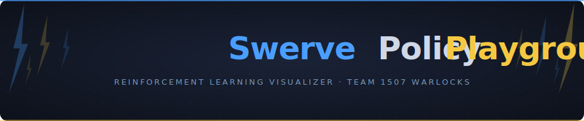

<div align="center">
  
</div>

<br/>

**Swerve Policy Playground** is a standalone reinforcement learning demonstration built by [Team 1507 – Warlocks](https://warlocks1507.com). A simulated swerve-drive robot learns to follow a fixed FRC-style path using Soft Actor-Critic (SAC) training — with no hardcoded path-following logic. The goal is not competition use. It is a visual teaching tool for showing students how a policy evolves from random stumbling to coordinated movement over hundreds of thousands of training steps.

---

## What This Demonstrates

- How an RL agent learns purely from reward signals — no hand-written "go toward the waypoint" code
- What **reward shaping** means in practice: every behavior you see is a direct consequence of the reward function in `swerve_env.py`
- How **swerve-drive kinematics** work at the individual module level, visualized in real time with AdvantageScope-style arrows
- The difference between an **early-training policy** (random, chaotic, exploiting reward loopholes) and a **late-training policy** (smooth, goal-directed, path-following)

---

## Quick Start

### Install dependencies
```bash
pip install gymnasium stable-baselines3 pygame matplotlib tqdm rich
```

### Train a policy
```bash
# Silent — fastest
python train.py

# With a Pygame window every 20k steps to watch progress
python train.py --render-eval --eval-freq 20000
```

Checkpoints are saved to `checkpoints/` every 10,000 steps automatically.

### Watch any checkpoint
```bash
python render.py checkpoints/swerve_50000_steps.zip
python render.py checkpoints/swerve_final.zip --speed 0.5   # half speed
```

### Plot the reward curve
```bash
python plot_rewards.py   # auto-selects the latest log in logs/
```

---

## File Overview

| File | Purpose |
|---|---|
| [`constants.py`](constants.py) | Every tunable parameter in one place — robot geometry, reward weights, render config, training hyperparams |
| [`kinematics.py`](kinematics.py) | WPILib-equivalent swerve IK, `ChassisSpeeds.discretize()`, wheel-speed desaturation, anti-jitter angle hold |
| [`field_path.py`](field_path.py) | Hardcoded 15-waypoint FRC-style loop, arc-length parameterization, monotonic waypoint tracker |
| [`swerve_env.py`](swerve_env.py) | Gymnasium environment — observation space, action space, reward function |
| [`renderer.py`](renderer.py) | Shared Pygame renderer used by both live training evals and the playback script |
| [`train.py`](train.py) | SAC training loop with checkpoint saving and reward CSV logging |
| [`render.py`](render.py) | Pygame playback from any saved checkpoint |
| [`plot_rewards.py`](plot_rewards.py) | matplotlib reward curve — raw episode rewards + rolling average |

---

## Reward Function

The reward function lives in `swerve_env.py → _compute_reward()`. All weights are in `constants.py` under `# Reward weights` and are designed to be edited directly — no digging required.

| Weight | Default | Effect |
|---|---|---|
| `RW_PROGRESS` | `1.0` | Reward per meter of arc-length progress. Goes negative if the robot moves backward. |
| `RW_VEL_ALIGN` | `0.8` | Reward for velocity aligned toward the current target waypoint. The primary anti-oscillation term. |
| `RW_CROSS_TRACK` | `-0.6` | Penalty proportional to distance from the path centerline. |
| `RW_SMOOTH_VEL` | `-0.30` | Penalty on sudden changes in commanded velocity between steps. |
| `RW_TIME_PENALTY` | `-0.02` | Flat per-step cost. Creates urgency — the agent cannot profit from loitering. |
| `RW_WAYPOINT_BONUS` | `2.0` | Bonus each time a waypoint is passed. |
| `RW_GOAL_BONUS` | `20.0` | Large bonus for completing the full path. |
| `RW_OFF_PATH_PENALTY` | `-10.0` | One-time penalty when the robot strays too far from the path. |

---

## Visualization

The Pygame renderer shows the full field with the robot driving in real time:

- **Path** — blue line with waypoint markers; completed segments dim as the robot passes them
- **Robot chassis** — procedurally drawn rectangle with a red front-edge heading indicator
- **Module housings** — four corner boxes that rotate with the chassis
- **AdvantageScope-style arrows** — one per module; arrow direction = wheel heading, arrow length = wheel speed
- **Speed rings** — color-coded rings on each module housing (dark = slow, green = fast)
- **HUD** — live step count, cumulative reward, path progress %, and cross-track error

---

## Tech Stack

| Layer | Technology |
|---|---|
| RL algorithm | [Stable-Baselines3](https://github.com/DLR-RM/stable-baselines3) SAC |
| Environment interface | [Gymnasium](https://gymnasium.farama.org/) |
| Swerve kinematics | Custom Python — WPILib `SwerveDriveKinematics` equivalent |
| Visualization | [Pygame](https://www.pygame.org/) |
| Reward plotting | [matplotlib](https://matplotlib.org/) |

Built by [Team 1507 – Warlocks](https://warlocks1507.com).
